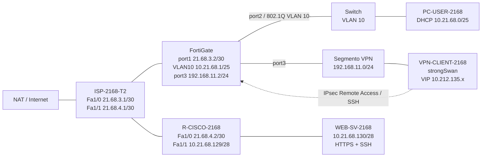

# Práctica #2 — Infraestructura #3: HTTPS sin VPN y SSH solo por VPN IPsec

**Asignatura:** Seguridad de Redes
**Estudiante:** [Luis Roble]
**Matrícula:** [2025-2168]

---

## 1. Objetivo

Montar en GNS3 un escenario donde el servidor web se pueda abrir por **HTTPS sin necesidad de VPN**, pero donde el acceso administrativo por **SSH solo funcione a través de una VPN IPsec de acceso remoto** que termina en el FortiGate.

Lo que se quiere demostrar:

- `PC-USER-2168` está en la **VLAN 10** y recibe IP por DHCP desde el FortiGate.
- El HTTPS de `WEB-SV-2168` se publica con NAT estático en `R-CISCO-2168` y responde con la VPN apagada.
- El SSH directo desde la red de usuarios está bloqueado por una política explícita en el FortiGate.
- Un cliente Linux con **strongSwan** levanta la VPN dial-up contra el FortiGate y recibe una IP virtual del pool `10.212.135.10 – 10.212.135.20`.
- La política del túnel deja pasar **solo SSH** hacia `WEB-SV-2168` (`10.21.68.130`).
- Con el túnel arriba el SSH entra; al bajarlo, deja de haber acceso.

---

## 2. Topología




---

## 3. Direccionamiento

| Equipo | Interfaz | Dirección |
| --- | --- | --- |
| ISP-2168-T2 | Fa0/0 (salida a Internet) | DHCP |
| ISP-2168-T2 | Fa1/0 hacia FortiGate | `21.68.3.1/30` |
| ISP-2168-T2 | Fa1/1 hacia R-CISCO | `21.68.4.1/30` |
| FortiGate | port1 (WAN-ISP) | `21.68.3.2/30` |
| FortiGate | VLAN10-USERS (sobre port2) | `10.21.68.1/25` |
| FortiGate | port3 (terminación VPN) | `192.168.11.2/24` |
| R-CISCO-2168 | Fa1/0 WAN | `21.68.4.2/30` |
| R-CISCO-2168 | Fa1/1 LAN servidor | `10.21.68.129/28` |
| WEB-SV-2168 | ens3 | `10.21.68.130/28` |
| PC-USER-2168 | VLAN 10 | DHCP `10.21.68.10 – 10.21.68.100` |
| VPN-CLIENT-2168 | ens3 | `192.168.11.X/24` |
| VPN-REMOTE-2168 | pool de clientes | `10.212.135.10 – 10.212.135.20` |

Detalle ampliado en [`docs/direccionamiento.md`](docs/direccionamiento.md).

---

## 4. Herramientas

- GNS3 (+ GNS3 VM)
- FortiGate VM64-KVM 7.0.9
- Cisco IOS 15.2 para `ISP-2168-T2` y `R-CISCO-2168`
- Cisco IOSvL2 como switch de usuarios
- Ubuntu para `PC-USER-2168`, `WEB-SV-2168` y `VPN-CLIENT-2168`
- strongSwan (cliente IPsec)
- Apache2 en 443 y OpenSSH en 22

---

## 5. Configuración

### 5.1 VLAN 10 y DHCP

El FortiGate es el gateway de los usuarios: la interfaz `VLAN10-USERS` cuelga de `port2` con VLAN ID 10 y dirección `10.21.68.1/25`. El servidor DHCP entrega del `.10` al `.100`, con DNS `8.8.8.8` y `1.1.1.1`.

En el switch, `Gi0/0` va como trunk 802.1Q (solo VLAN 10) hacia el FortiGate y `Gi0/1` como acceso VLAN 10 hacia el PC.


### 5.2 FortiGate

Interfaces usadas:

- `port1` (WAN-ISP): `21.68.3.2/30`
- `VLAN10-USERS`: `10.21.68.1/25`
- `port3`: `192.168.11.2/24`, también se usa para entrar a la GUI
- `VPN-REMOTE-2168`: túnel dial-up sobre `port3`

Ruta por defecto: `0.0.0.0/0` por `21.68.3.1` (port1).


### 5.3 Políticas de firewall

| ID | Nombre | Origen → Destino | Servicio | Acción | NAT |
| --- | --- | --- | --- | --- | --- |
| 3 | `DENY-DIRECT-SSH-WEB` | VLAN10-USERS → WEB-SV-2168 | SSH | DENY | No |
| 1 | `USER-TO-INTERNET` | VLAN10-USERS → port1 | ALL | ACCEPT | Sí |
| 4 | `vpn_VPN-REMOTE-2168_remote_0` | VPN-REMOTE-2168 → WEB-SV-2168 | SSH | ACCEPT | Sí |

El orden importa: la política 3 está por encima de la 1, así el SSH de los usuarios hacia el servidor se corta antes de que la regla general de salida lo deje pasar.


### 5.4 R-CISCO-2168 y publicación del HTTPS

El router une la red del servidor con el ISP:

- `Fa1/0` → `21.68.4.2/30` (`ip nat outside`)
- `Fa1/1` → `10.21.68.129/28` (`ip nat inside`)
- Ruta por defecto hacia `21.68.4.1`

El HTTPS se publica con un NAT estático sobre la interfaz WAN:

```
ip nat inside source static tcp 10.21.68.130 443 interface FastEthernet1/0 443
```

Es decir, `21.68.4.2:443 → 10.21.68.130:443`.

Para el SSH que llega por la VPN, el FortiGate hace NAT y el servidor responde a `21.68.3.2`. Ese tráfico no debe pasar por el PAT del router, así que la ACL 101 lo excluye:

```
access-list 101 deny   ip 10.21.68.128 0.0.0.15 host 21.68.3.2
access-list 101 permit ip 10.21.68.128 0.0.0.15 any
```


### 5.5 ISP

El ISP hace PAT hacia Internet para las dos redes WAN (ACL 1) y tiene una ruta estática para llegar a la LAN del servidor:

```
ip route 10.21.68.128 255.255.255.240 21.68.4.2
```


### 5.6 VPN IPsec Remote Access

El túnel `VPN-REMOTE-2168` termina en `port3` del FortiGate. Autenticación con clave precompartida más XAUTH (usuario `vpn2168`, grupo `SSLVPN-USER-2168`).

**Fase 1**

- IKEv1, modo agresivo
- Propuestas `des-md5` y `des-sha1`
- Tipo dinámico (dial-up), `mode-cfg` habilitado
- Pool: `10.212.135.10 – 10.212.135.20`
- Split tunnel: solo `WEB-SV-2168` (`10.21.68.130/32`)

**Fase 2**

- Propuestas `des-md5` y `des-sha1`
- Resto de parámetros (PFS, lifetime) con los valores por defecto de FortiOS 7.0


> IKEv1 en modo agresivo, DES y SHA1 están aquí solo por compatibilidad con el laboratorio. No son parámetros para un despliegue real.

### 5.7 Cliente strongSwan

`VPN-CLIENT-2168` negocia contra `192.168.11.2`. La configuración está en [`configs/VPN-CLIENT-2168-ipsec.conf`](configs/VPN-CLIENT-2168-ipsec.conf); las credenciales reales no se suben, solo un [`ipsec.secrets.example`](configs/ipsec.secrets.example).

Al levantar el túnel el cliente recibe una IP del pool y strongSwan instala una ruta específica hacia `10.21.68.130`.


### 5.8 Servidor

`WEB-SV-2168`: IP `10.21.68.130/28`, gateway `10.21.68.129`, Apache2 en TCP/443 y OpenSSH en TCP/22.


---

## 6. Validación

### 6.1 HTTPS sin VPN

Desde `PC-USER-2168`, con el túnel apagado:

```
curl -k -I https://21.68.4.2
```

Debe responder `HTTP/1.1 200 OK` con el banner de Apache.


### 6.2 SSH directo bloqueado

Desde el mismo PC:

```
ssh -o ConnectTimeout=5 usuario@10.21.68.130
```

Resultado esperado: `Connection timed out`.


### 6.3 SSH con la VPN arriba

```
sudo ipsec up VPN-REMOTE-2168
ssh usuario@10.21.68.130
```


### 6.4 SSH con la VPN abajo

```
sudo ipsec down VPN-REMOTE-2168
ssh usuario@10.21.68.130
```

Sin túnel no hay ruta ni acceso al servidor.


La tabla completa de pruebas está en [`docs/validacion.md`](docs/validacion.md).

---

## 7. Configuraciones y scripts

- [`running-configs/`](running-configs): extracto del FortiGate (sin claves), `ISP-2168-T2.txt`, `R-CISCO-2168.txt` y `SW-2168.txt`.
- [`configs/`](configs): `ipsec.conf` del cliente, `ipsec.secrets.example` y los netplan de los equipos Linux.
- [`scripts/`](scripts): scripts de apoyo para preparar el servidor y repetir las comprobaciones.

El extracto del FortiGate no incluye la PSK, la contraseña del usuario VPN ni las contraseñas de administración.

---

## 8. Resultado

- El **HTTPS sigue disponible sin VPN** gracias a la publicación del puerto 443 en el router Cisco.
- El **SSH directo desde la red de usuarios está bloqueado** por el FortiGate.
- El **SSH solo funciona a través de la VPN**: el FortiGate autentica al cliente, le asigna una IP virtual, limita el split tunnel al servidor y permite únicamente el servicio SSH.

---

## Estructura del repositorio

```
-PRACTICA-2---INF-3/
├── README.md
├── docs/
│   ├── direccionamiento.md
│   └── validacion.md
├── img inf 3/
├── running-configs/
│   ├── README.md
│   ├── FG-2168-sanitized.conf
│   ├── ISP-2168-T2.txt
│   ├── R-CISCO-2168.txt
│   └── SW-2168.txt
├── configs/
│   ├── VPN-CLIENT-2168-ipsec.conf
│   ├── ipsec.secrets.example
│   ├── WEB-SV-2168-netplan.yaml
│   ├── PC-USER-2168-netplan.yaml
│   └── VPN-CLIENT-2168-netplan.yaml
└── scripts/
    ├── README.md
    ├── web-server-services-setup.sh
    ├── test-pc-user.sh
    ├── test-vpn-client.sh
    ├── switch-setup.txt
    └── r-cisco-critical-config.txt
```
